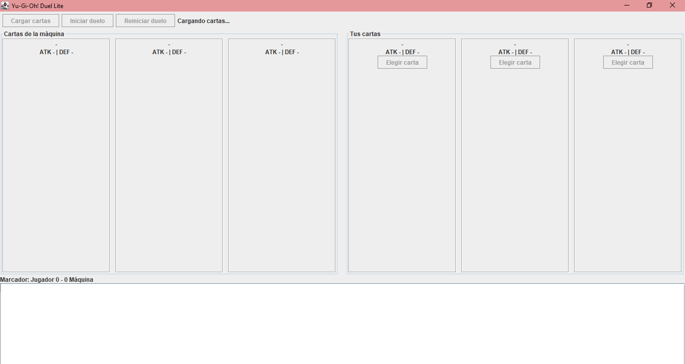
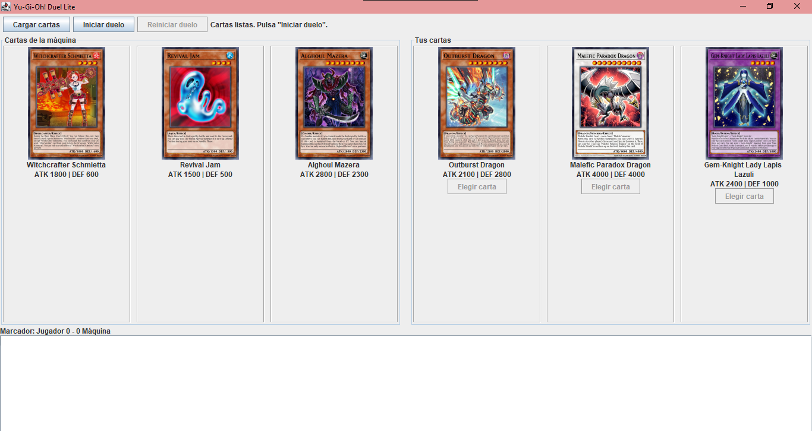
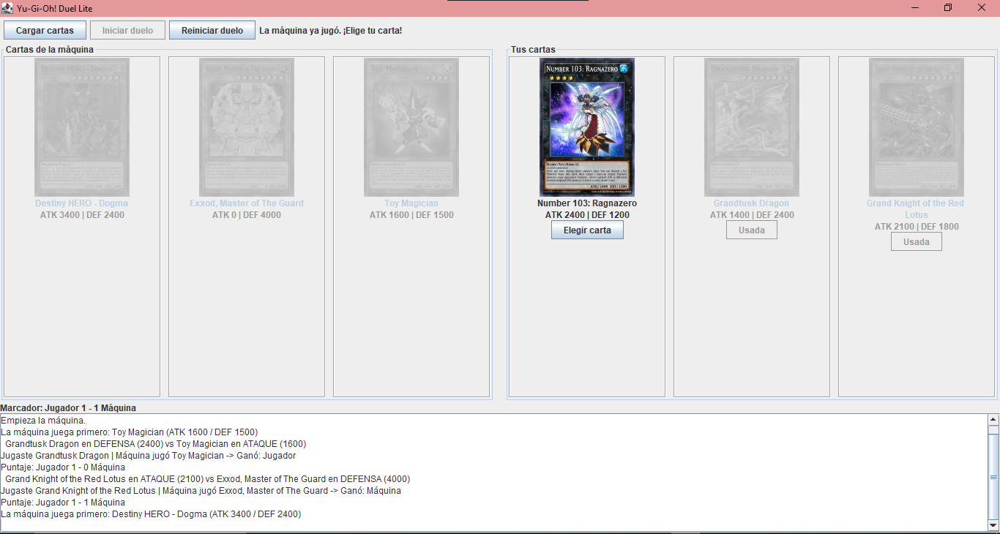
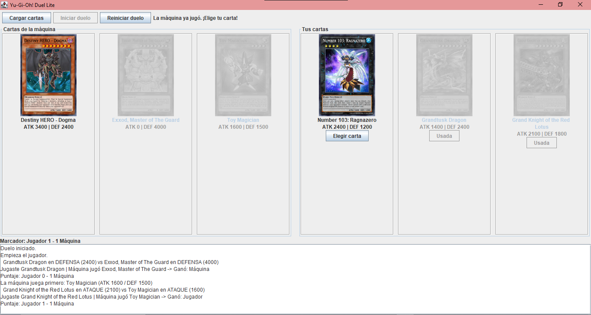
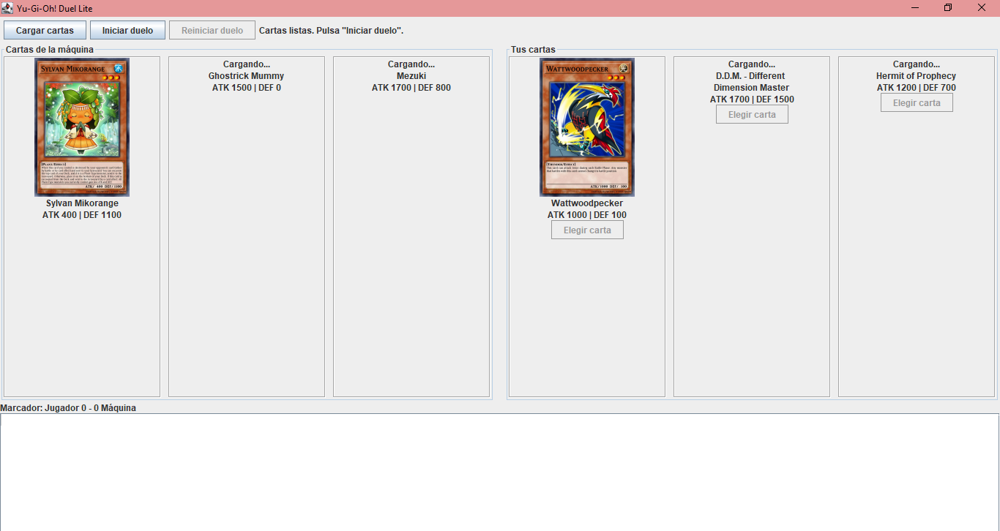

## Yugioh-Duel

Aplicación de escritorio en Java Swing que consulta la API de YGOProDeck y simula un duelo sencillo de Yu-Gi-Oh! entre el jugador y la máquina. Laboratorio #1 de Desarrollo de Software III, Universidad del Valle, Sede Tuluá.

Autores: Marlon Andres Cuellar y Nicol Vanessa Peña Jimenez

## Características

- Carga de 3 cartas Monster para el jugador y 3 para la máquina, de forma aleatoria, desde la API de YGOProDeck (imagen oficial, nombre, ATK y DEF). Si la API devuelve una carta que no es Monster, se vuelve a pedir.
- Se muestran las cartas de ambos lados: las del jugador con botón **Elegir carta** y las de la máquina solo visibles. Las cartas ya usadas se ponen en gris.
- Duelo por rondas: el primero en ganar 2 rondas gana el duelo.
- Turno inicial aleatorio: quien tiene la iniciativa juega primero (si es la máquina, su carta se ve antes de elegir la tuya).
- Log de batalla desplazable con quién jugó qué carta, el resultado de cada ronda, el marcador y el ganador final.
- Botones para cargar cartas nuevas y para reiniciar el duelo con las mismas cartas, sin congelar la ventana.
- Errores visibles en pantalla ("No se pudo cargar la carta", "Error de red").

## Requisitos

- JDK 11 o superior (el proyecto se desarrolló con JDK 27)
- IntelliJ IDEA (o cualquier IDE que abra proyectos IntelliJ)
- Conexión a internet (para consultar la API y descargar las imágenes de las cartas)
- Librería `lib/json-20230227.jar` (ya incluida en el repositorio)

## Instrucciones de ejecución

1. Clonar el repositorio:
   ```
   git clone https://github.com/Andres23-C/Yugioh-Duel.git
   ```
2. Abrir la carpeta del proyecto en IntelliJ.
3. Marcar `src` como **Sources Root** si no lo está (clic derecho sobre `src` → **Mark Directory as**).
4. Agregar la librería JSON: clic derecho sobre `lib/json-20230227.jar` → **Add as Library...** (o **File → Project Structure → Libraries → + → Java** y seleccionar el jar).
5. Ejecutar la clase `view.MainWindow`.
6. Al abrir la ventana se cargan solas las cartas. Pulsar **Iniciar duelo**.
7. Elegir una carta con **Elegir carta** en cada ronda hasta que alguien llegue a 2 rondas ganadas.
8. Con **Reiniciar duelo** se juega de nuevo con las mismas cartas; con **Cargar cartas** se piden cartas nuevas.

Opcional, por terminal (PowerShell):
```
javac -encoding UTF-8 -cp lib/json-20230227.jar -d out (Get-ChildItem -Recurse src -Filter *.java).FullName
java -cp "out;lib/json-20230227.jar" view.MainWindow
```

## Estructura del proyecto

```
src/
├── api/      YgoApiClient: consulta la API y construye las cartas Monster
├── model/    Card: nombre, ATK, DEF y URL de la imagen
├── battle/   BattleListener, Duel y DuelDemo: lógica del duelo
└── view/     MainWindow y CardPanel: interfaz Swing
lib/          json-20230227.jar
```

`DuelDemo` es una prueba en consola de las reglas, sin ventana ni internet.

## Reglas del duelo

El enunciado compara ATK contra DEF pero no aclara quién está en ataque y quién en defensa, por eso se definieron estas reglas:

| Regla | Detalle |
|---|---|
| Cartas | 3 por jugador, cada una se usa una sola vez |
| Carta de la máquina | Elige al azar entre las que le quedan |
| Quién inicia | Se sortea al crear el duelo; la iniciativa se alterna en cada ronda |
| Posición de cada carta | Mejor posición: si `ATK >= DEF` está en **ataque** (combate con su ATK); si no, en **defensa** (combate con su DEF) |
| Ambas en ataque | Gana el mayor ATK |
| Una en ataque y otra en defensa | Se compara el ATK del atacante contra el DEF del defensor |
| Ambas en defensa | Gana el mayor DEF (caso no previsto en el enunciado) |
| Empate | Gana quien tiene la iniciativa en esa ronda, por eso nunca hay empate |
| Punto de ronda | El ganador de cada ronda obtiene 1 punto |
| Fin del duelo | El primero en llegar a 2 rondas gana (como máximo 3 rondas) |

## Diseño

La lógica del duelo está en el paquete `battle`, separada por completo de la interfaz. La clase `Duel` decide quién inicia, deja que la máquina elija su carta al azar, compara ATK contra DEF y lleva el marcador, y notifica lo ocurrido a través de la interfaz `BattleListener`, siguiendo el patrón Observer. Así la lógica se puede probar sin ventana (con `DuelDemo`), y la interfaz solo se actualiza reaccionando a los eventos `onTurn`, `onScoreChanged` y `onDuelEnded`, más dos eventos opcionales: `onRoundDetail` (explica por qué ganó cada ronda) y `onMachinePlays` (la máquina juega primero cuando tiene la iniciativa).

Para no bloquear la ventana, las peticiones a la API (`HttpClient`) y la descarga de las imágenes se hacen con `SwingWorker`, y los resultados se pintan de vuelta en el hilo de Swing. `Duel` no necesita hilos propios porque no hace llamadas de red. Valida los datos de entrada (3 cartas por lado, índices válidos, cartas no repetidas) y actualiza todo su estado antes de avisar al listener, de modo que el duelo siempre termina y nunca queda inconsistente.

## Capturas de pantalla

<!-- Guardar las imágenes en la carpeta Capturas y ajustar los nombres -->

### Interfaz principal



### Cartas cargadas



### Duelo en curso



### Duelo Reiniciado



### Nuevas Cartas


